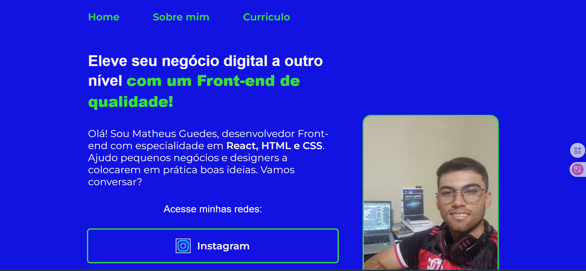

# 🌐 Meu Portfólio Pessoal

Bem-vindo ao meu **portfólio pessoal**, desenvolvido durante a **Formação Iniciante em Programação - Oracle Next Education & Alura**.  
Este projeto foi criado para aplicar e consolidar os conhecimentos adquiridos nos cursos da formação, mostrando minhas habilidades em desenvolvimento web, versionamento e engenharia de prompt.

---

## 🛠 Tecnologias e Ferramentas Utilizadas

- **HTML**
  - Estrutura das páginas do portfólio
  - Cabeçalho e footer
  - Página "Sobre mim" com título, parágrafos e imagem
- **CSS**
  - Estilização de páginas
  - Classes reutilizáveis
  - Variáveis CSS
  - Técnicas de posicionamento e **Flexbox**
- **Git e GitHub**
  - Versionamento do projeto
  - Criação e gerenciamento de repositórios
  - Resolução de conflitos
  - Publicação online
- **Visual Studio Code (VSCode)**
  - Ambiente de desenvolvimento integrado
- **Engenharia de Prompt (Prompt Engineering)**
  - Criação de conteúdos claros
  - Otimização de textos do portfólio

---

## 🚀 Funcionalidades do Projeto

- Layout **responsivo e organizado**
- Cabeçalho e footer padronizados
- Página "Sobre mim" com título, textos e imagem
- Código limpo e reutilizável com classes CSS
- Histórico de versionamento no GitHub
- Conteúdos otimizados usando técnicas de **Prompt Engineering**

---

## 🖼 Print do Projeto

---

## 🌐 Acesse o Projeto Online

[🔗 Ver no Vercel](https://seu-projeto.vercel.app)  
*Projeto hospedado no Vercel.*

---

## 📱 Redes Sociais

  

---

## 🎯 Objetivo

Este portfólio foi desenvolvido para **demonstrar meus aprendizados**, organizar meus projetos e servir como **vitrine profissional** para futuras oportunidades na área de desenvolvimento web.

---

